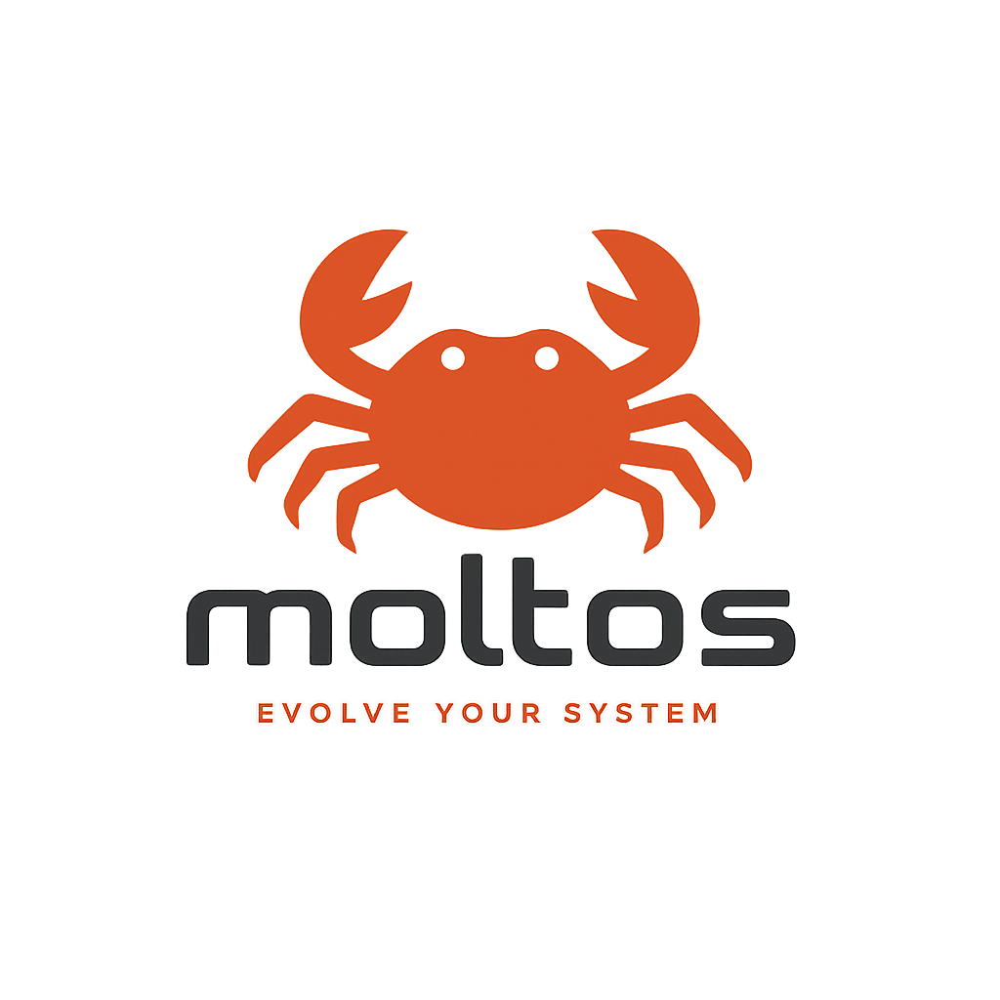
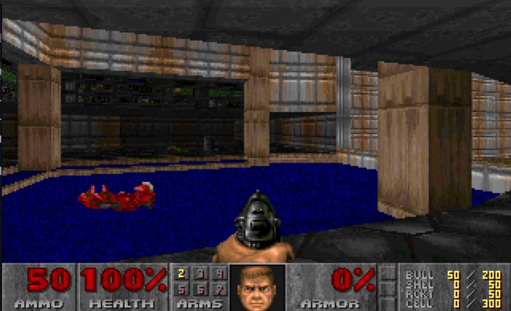

# MoltOS



A hobby x86_64 kernel written in Rust, demonstrating memory management, preemptive multitasking, interrupt handling, and async/await. It runs Doom.



## Features

- **Memory**: Virtual memory with paging, heap allocation (bump/linked-list/fixed-size block), physical frame allocator
- **Interrupts**: IDT, PIT-based preemptive scheduling, PS/2 keyboard, exception handling
- **Multitasking**: Kernel threads with EEVDF scheduler (round-robin alternative), context switching
- **Async**: Custom executor, waker-based task scheduling, async sleep, keyboard input stream
- **Shell**: VGA text mode (80x25), serial debug output, built-in commands: `help`, `clear`, `echo`, `uptime`, `mem`
- **Doom**: VGA mode 13h framebuffer (320x200, 256 color), runs doomgeneric as a kernel thread

## Build

Requires Rust nightly, `bootimage`, and QEMU.

```bash
cargo build   # build
cargo run     # run in QEMU
cargo test    # run tests in QEMU
```

To run Doom, place `doom1.wad` in the root of the repo and type `doom` at the shell prompt. The kernel will switch to graphics mode and launch the game.

## Project Structure

```
src/
├── main.rs / lib.rs     # Entry point, initialization
├── gdt.rs               # Global Descriptor Table
├── interrupts.rs        # IDT, PIC, interrupt handlers
├── memory.rs            # Page tables, frame allocation
├── allocator.rs         # Heap allocator implementations
├── vga_buffer.rs        # VGA text mode driver
├── serial.rs            # Serial port output
├── task/                # Async executor, shell, keyboard, sleep
└── thread/              # Scheduler (EEVDF/RR), context switch, stacks
```

## Memory Layout

- Heap: 100 KiB at `0x4444_4444_0000`
- Stacks: 16 KiB per thread
- VGA buffer: `0xb8000` (identity-mapped)

## Boot Sequence

GDT/TSS → IDT → PIC → heap → VGA map → spawn executor thread → scheduler loop
